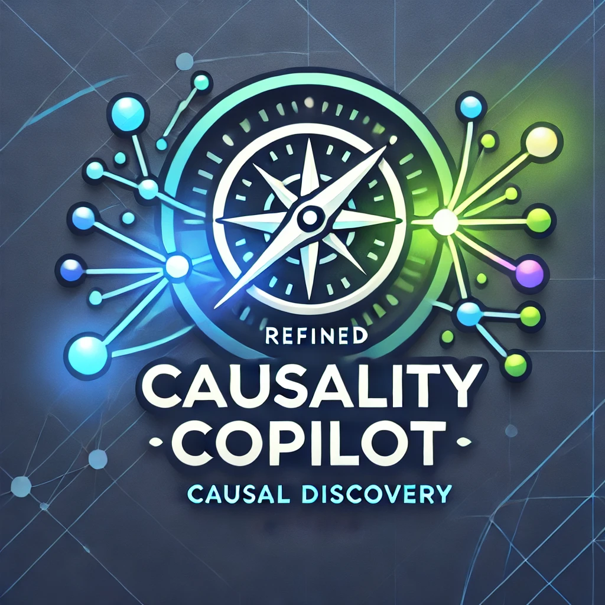

<h1 align="center">

<br>
Causality Copilot: Towards Autonomous Causal Discovery Agent
</h1>
<p align="center">
  <a href="https://921b68852c4d574f0e.gradio.live/"><b>[Demo]</b></a> •
  <a href="https://github.com/Lancelot39/Causality-Copilot"><b>[Code]</b></a>
</p>


---

## Introduction

Causality-Copilot is a LLM-oriented toolkit for **automatic causal discovery**, aiming to help researchers and data scientists identify causal relationships within real-world datasets. Given the data, Causality Copilot autonomously selects the best-suited causal discovery algorithm, sets up proper hyper-parameters, synthesizes the code for execution, and finally generates the easy-to-read PDF report to users.

---

## Demo

- Demo Video (TODO)

- Here are some analysis reports generated by Causality-Copilot (TODO)

- Just try the online Causality-Copilot in [This Link](https://921b68852c4d574f0e.gradio.live/)

---

## Table of Contents

- [Demo](#Demo)
- [Features](#features)
- [Getting Started](#getting-started)
- [Usage](#usage)
- [License](#license)
- [Contact](#Contact)

---

## Features

- **Automated Causal Discovery**: Carefully designed prompts guide LLMs to use causal discovery algorithms and identify causal relationships, without human involvement and extensive parameter tuning.
- **User-friendly Visualization**: Clearly represent data statistics information, causal graphs and dependencies between variables via easy-to-read figures.
- **Detailed Analysis Report**: Provide well-formulated PDF report for the whole causal discovery process, containing detailed explanation for every step.
- **Extensibility**: Leave interfaces for integrating new causal discovery algorithms and other causality-related libraries.

### Evaluation on Simulated Data

- We evaluate the automatic causal discovery ability of our Causality-Copilot on simulated data, by comparing its performance with a robust baseline using the defaulted settings of PC algorithm.
- The results show that our Causality-Copilot can achieve much better performance, indicating the effectiveness of its automatic algorithm selection and hyper-parameter setting strategy.

| Metric    | Baseline | Causality-Copilot |
|-----------|----------|-------------------|
| Precision | 78.6%    | **81.6%**         |
| Recall    | 78.2%    | **81.0%**         |
| F1-score  | 76.1%    | **79.3%**         |

---

## Getting Started

### Online Demo

- Welcome to use the online Causality-Copilot via [This Link](https://921b68852c4d574f0e.gradio.live/)


### Local Deployment

- **Python 3.8+**
- Required Python libraries (specified in `requirements.txt`)

Ensure you have the necessary dependencies installed by running:

```bash
pip install -r requirements.txt
```

---

## Usage

```bash
python main.py --data_file your_data --apikey your_openai_apikey --initial_query your_user_query
```

## License

Distributed under the MIT License. See `LICENSE` for more information.

---

## Contact

For additional information, questions, or feedback, please contact our team at **support@causalitycopilot.com**. We welcome contributions!

