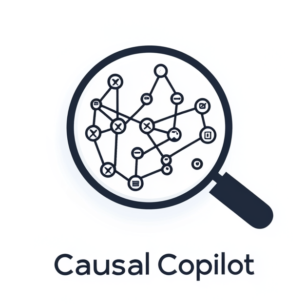
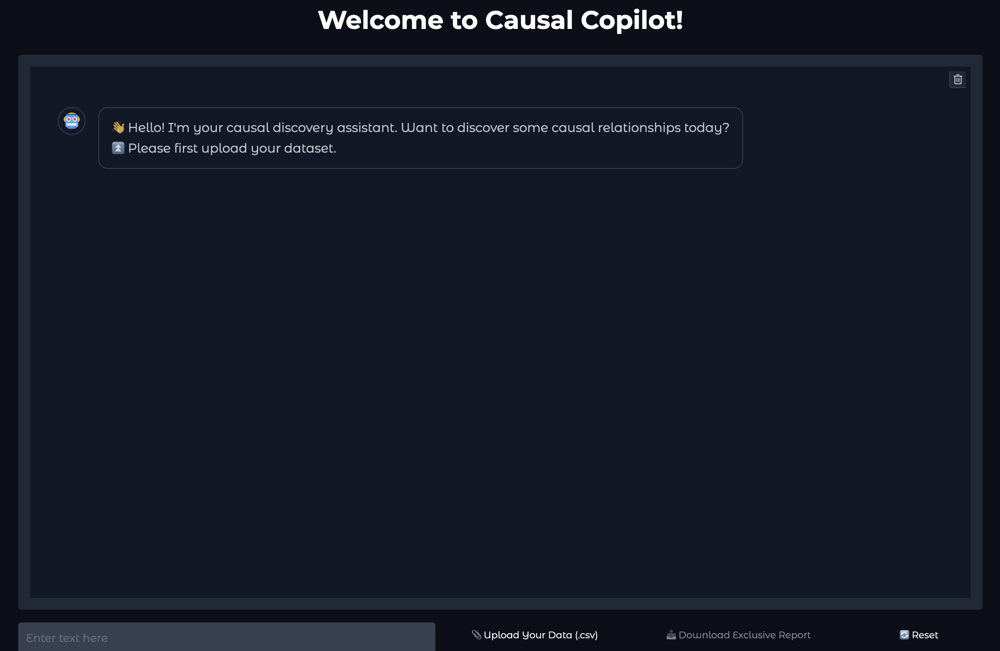

<h1 align="center">

<br>
Causal-Copilot: An Autonomous Causal Analysis Agent
</h1>
<p align="center">
  <a href="https://huggingface.co/spaces/Causal-Copilot/Causal-Copilot"><b>[Demo]</b></a> •
  <a href="https://github.com/Lancelot39/Causal-Copilot"><b>[Code]</b></a> •
  <a href="https://github.com/Lancelot39/Causal-Copilot"><b>[Technical Report]</b></a>
</p>

---
## News
 **04/16/2025**: We release **Causal-Copilot-V2** and the official **Technical Report**. The new version supports automatically using 20 state-of-the-art causal analysis techniques, spanning from causal discovery, causal inference, and other analysis algorithms.

 **11/04/2024**: We release **Causal-Copilot-V1**, the first autonomous causal analysis agent.

---

## Introduction
Identifying causality lets scientists look past correlations and uncover the mechanisms behind natural and social phenomena. Although many advanced methods for causal discovery now exist, their varied assumptions and technical complexity often discourage non‑experts from using them.

**Causal‑Copilot** addresses this gap. Guided by a LLM, it automates the full causal‑analysis workflow: data inspection, algorithm and hyperparameter selection, code generation, uncertainty assessment, and PDF report creation— all triggered through simple dialogue. By combining LLM‑driven domain knowledge with state‑of‑the‑art causal techniques, Causal‑Copilot lets researchers focus on scientific insight instead of implementation details.

<p align="center">
  🔍 Try out our interactive demo: <a href="https://huggingface.co/spaces/Causal-Copilot/Causal-Copilot"><b>Causal-Copilot Live Demo</b></a>
</p>

---

## Demo

### Video Demo

[](https://www.youtube.com/watch?v=A6j80I97Slg)

### Report Examples

We provide some examples of our system automatically generated reports for open-source datasets generated as follows:

- [1. Bioinformatics-Abalone](asset/report_Abalone.pdf)
- [2. Architecture-CCS](asset/report_CCS.pdf)
- [3. Bioinformatics-Sachs](asset/report_Sachs.pdf)

---

## Table of Contents

- [Demo](#Demo)
- [Features](#features)
- [Getting Started](#getting-started)
- [Usage](#usage)
- [License](#license)
- [Contact](#Contact)

---

## Features

- **Automated Causal Analysis** – An LLM automatically picks and tunes the best causal‑analysis algorithms, embedding expert heuristics so users need no specialized knowledge.  
- **Statistical + LLM Post‑Processing** – Performs bootstrap edge‑uncertainty checks and refines the causal graph (pruning, edge re‑direction) using the LLM’s prior knowledge.  
- **Chat‑Style Interface** – Users steer the entire analysis via natural dialogue and receive clear visualizations of data stats and causal graphs—no technical setup required.  
- **Complete Analysis Report** – Outputs a concise PDF that documents methods, shows intuitive visuals, and explains key findings.  
- **Extensible Framework** – Open interfaces let developers plug in new causal algorithms or external libraries with minimal effort.

### Architecture Details

- **Causal‑Copilot** adopts a modular architecture built around five primary components—**Simulation, User Interaction, Preprocessing, Algorithm Selection,** and **Postprocessing**—that together deliver an end‑to‑end causal analysis pipeline. A large language model (LLM) sits at the core of the framework, coordinating data flow among these modules while tapping into auxiliary resources such as a causality‑focused knowledge base and a library of local algorithms. All modules communicate via unified interfaces that pass structured metadata and intermediate results, allowing the LLM to supervise execution seamlessly. This organization preserves clear separation of concerns, simplifies extension, and makes it straightforward to integrate new capabilities into the system.

<h1 align="center">
<div style="text-align: center;">
    
</div>
</h1>

- Causal-Copilot integrates over twenty state-of-the-art causal analysis algorithms, broadly categorized into **causal discovery**, **causal inference**, and **auxiliary analysis tools**.

<h1 align="center">
<div style="text-align: center;">
    
</div>
</h1>

### Autonomous Workflow

- Powered by an integrated LLM, **Causal‑Copilot** delivers a fully autonomous causal‑analysis pipeline. A user simply uploads a tabular dataset and a natural‑language query. The LLM—augmented by rule‑based routines—parses the query, cleans the data, infers variable types, and fills in missing values. It then chooses the best causal method, tunes its hyperparameters, and generates the code to run it. After execution (e.g., producing a causal graph), the LLM checks for inconsistencies, optionally queries the user for clarification, and can chain additional steps—such as effect or counterfactual estimation—on top of the discovered structure. The system concludes by compiling an interpretable PDF report that summarizes the data, details intermediate choices, and visualizes the final causal results, making the analysis accessible to non‑experts.

<h1 align="center">
<div style="text-align: center;">
    
</div>
</h1>

### Evaluation on Simulated Data

- To test Causal‑Copilot thoroughly, we built a concise yet diverse evaluation suite. Synthetic tabular datasets vary in variable count, graph density, functional form (linear vs. non‑linear), and noise levels. Synthetic time‑series data vary in dimensionality, length, lag structure, and noise type. We also create compound benchmarks, e.g., clinical, financial, and IoT scenarios—that bundle multiple challenges to mimic real‑world complexity. Each dataset has a known ground‑truth graph, allowing us to measure how well the automated pipeline discovers causal structure under a wide range of conditions.
- The results show that our Causal-Copilot can achieve much better performance, indicating the effectiveness of its automatic algorithm selection and hyper-parameter setting strategy, in a autonomous manner.

<h1 align="center">
<div style="text-align: center;">
    
</div>
</h1>

---

## Getting Started

### Online Demo

<p align="center">
  🔍 Try out our interactive demo: <a href="https://huggingface.co/spaces/Causal-Copilot/Causal-Copilot"><b>Causal-Copilot Live Demo</b></a>
</p>


### Local Deployment

- **Python 3.8+**
- Required Python libraries (specified in `setup/requirements_cpu.txt` and `setup/requirements_gpu.txt`)
- Required LaTeX packages (`tinyTex`)

Ensure you have the necessary dependencies installed by choosing the appropriate dependencies (CPU/GPU + Tex):

#### CPU Dependencies

If you don't have a Nvidia GPU, you can't use the GPU accelerated algorithms (e.g. AcceleratedLiNGAM). You can use the CPU version by running:

```bash
pip install -r setup/requirements_cpu.txt --no-deps
```

#### GPU Dependencies

If you have a Nvidia GPU, you can use the GPU accelerated algorithms by running:

```bash
pip install -r setup/requirements_gpu.txt --no-deps
```


### Tex Dependencies

Install the `tinyTex` package to generate PDF reports:

For Mac:

```
$ rm -rf ~/Library/TinyTeX
$ wget -qO- "https://yihui.org/tinytex/install-bin-unix.sh" | sh
$ export PATH="$PATH:$HOME/Library/TinyTeX/bin/universal-darwin" 
$ source ~/.zshrc

$ tlmgr update --self
$ tlmgr install fancyhdr caption subcaption nicefrac microtype lipsum graphics natbib doi

```

For Linux:

```
$ rm -rf ~/.TinyTeX
$ wget -qO- "https://yihui.org/tinytex/install-bin-unix.sh" | sh
$ export PATH="$PATH:$HOME/.TinyTeX/bin/x86_64-linux"
$ source ~/.bashrc

$ tlmgr update --self
$ tlmgr install fancyhdr caption subcaption nicefrac microtype lipsum graphics natbib doi
```

---

## Usage

```bash
python main.py --data_file your_data --apikey your_openai_apikey --initial_query your_user_query
```

## License

Distributed under the MIT License. See `LICENSE` for more information.

## Resource 

- Our codes for causal discovery are from the [causal-learn](https://causal-learn.readthedocs.io/en/latest/index.html) and [CausalNex](https://causalnex.readthedocs.io/en/latest/) projects, currently including [PC](https://link.springer.com/book/10.1007/978-1-4612-2748-9), [FCI](https://arxiv.org/abs/1302.4983), [CDNOD](https://arxiv.org/abs/1903.01672), [GES](https://www.jmlr.org/papers/volume3/chickering02b/chickering02b.pdf), [NOTEARS](https://arxiv.org/abs/1803.01422), [DirectLiNGAM](https://jmlr.org/papers/volume12/shimizu11a/shimizu11a.pdf), [ICALiNGAM](https://jmlr.org/papers/volume7/shimizu06a/shimizu06a.pdf)
- Our PDF template is based on this [overleaf project](https://www.overleaf.com/latex/templates/style-and-template-for-preprints-arxiv-bio-arxiv/fxsnsrzpnvwc)
- Our example datasets are from [Bioinformatics-Abalone](https://archive.ics.uci.edu/dataset/1/abalone), [Architecture-CCS](https://netl.doe.gov/carbon-management/carbon-storage/worldwide-ccs-database), [Bioinformatics-Sachs](https://www.science.org/doi/10.1126/science.1105809)
- Our codes for deployment are from [Gradio](https://www.gradio.app/)

---

## Contact

For additional information, questions, or feedback, please contact ours **[Xinyue Wang](xiw159@ucsd.edu)**, **[Kun Zhou](franciskunzhou@gmail.com)**, **[Wenyi Wu](wew058@ucsd.edu)**, and **[Biwei Huang](bih007@ucsd.edu)**. We welcome contributions! Come and join us now!

If you use Causal-Copilot in your research, please cite it as follows:

```
@inproceedings{causalcopilot,
  title={Causal-Copilot: An Autonomous Causal Analysis Agent},
  author={Wang, Xinyue and Zhou, Kun and Wu, Wenyi and Nan, Fang and Huang, Biwei},
  year={2024}
}
```
