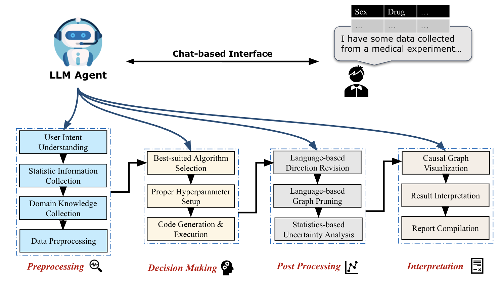

<h1 align="center">

<br>
Causal-Copilot: An Autonomous Causal Analysis Agent
</h1>
<p align="center">
  <a href="https://2feffbc3022fa90033.gradio.live"><b>[Demo]</b></a> •
  <a href="https://github.com/Lancelot39/Causal-Copilot"><b>[Code]</b></a>
</p>


---

## Introduction
Understanding causal relationships is fundamental to scientific discovery, enabling researchers to move beyond mere correlation and establish the underlying mechanisms that drive natural and social phenomena. Recent years have witnessed significant theoretical advancements in causal discovery, yielding a diverse array of sophisticated methodologies. However, the complexity of these methods—each with its distinct assumptions, applicability conditions, and technical nuances—has created substantial barriers for scientists outside the field of causal analysis, often deterring them from adopting these powerful analytical tools in their research.

Causal-Copilot is a LLM-oriented toolkit for **automatic causal analysis** that uniquely integrates domain knowledge from large language models with established expertise from causal discovery researchers. Designed for scientific researchers and data scientists, it facilitates the identification, analysis, and interpretation of causal relationships within real-world datasets through natural dialogue. The system autonomously orchestrates the entire analytical pipeline-analyzing statistics, selecting optimal causal analysis algorithms, configuring appropriate hyperparameters, synthesizing executable code, conducting uncertainty quantification, and generating comprehensive PDF reports—while requiring minimal expertise in causal methods. This seamless integration of conversational interaction and rigorous methodology culminates enables researchers across disciplines to focus on domain-specific insights rather than technical implementation details.

<p align="center">
  🔍 Try out our interactive demo: <a href="https://2feffbc3022fa90033.gradio.live"><b>Causal-Copilot Live Demo</b></a>
</p>

---

## Demo

### Video Demo

[](https://www.youtube.com/watch?v=A6j80I97Slg)

### Report Examples

We provide some examples of our system automatically generated reports for open-source datasets generated as follows:

- [1. Bioinformatics-Abalone](asset/report_Abalone.pdf)
- [2. Architecture-CCS](asset/report_CCS.pdf)
- [3. Bioinformatics-Sachs](asset/report_Sachs.pdf)

---

## Table of Contents

- [Demo](#Demo)
- [Features](#features)
- [Getting Started](#getting-started)
- [Usage](#usage)
- [License](#license)
- [Contact](#Contact)

---

## Features

- **Automated Causal Analysis**: Harnesses the power of large language models combined with domain expertise to select optimal causal analysis algorithms and hyperparameters. Incorporates proven methodological insights from causal discovery researchers to ensure the analytical reliability, without the requirements in expertise about causality and extensive parameter tuning. 
- **Statistical-LLM Hybrid Post Processing**: Present the edge uncertainty examination (bootstrap), as well as graph pruning and direction revision driven by LLM's prior knowledge.
- **Chat-based User-friendly Interface**: Navigate complex causal analysis through natural dialogue, and visualize data statistics and causal graphs through clear, intuitive figures, without wrestling with technical details. 
- **Comprehensive Analysis Report**: Provide well-formulated scientific report for the whole causal analysis process, containing detailed explanation documenting the complete analytical process, intuitive visualization and in-depth interpretation of the findings.
- **Extensibility**: Maintain open interfaces for integrating new causal analysis algorithms and support seamless incorporation of emerging causality-related libraries and methodologies

### Architecture Details

- Our Causal-Copilot consists of four components, namely preprocessing, decision making, post processing and intepretation parts, which are all supported by SOTA LLMs (e.g., GPT-4o, GPT-4o-mini).

<h1 align="center">
<div style="text-align: center;">
    
</div>
</h1>

### Evaluation on Simulated Data

- We evaluate the automatic causal discovery ability of our Causal-Copilot on in total 180 simulated datasets including different types of functional forms, graph sparsity, noise types and heterogeneity, compared with a robust baseline, PC algorithm with the default setting.
- The results show that our Causal-Copilot can achieve much better performance, indicating the effectiveness of its automatic algorithm selection and hyper-parameter setting strategy, in a autonomous manner.

| Metric    | Baseline | Causal-Copilot |
|-----------|----------|----------------|
| Precision | 78.6%    | **81.6%**      |
| Recall    | 78.2%    | **81.0%**      |
| F1-score  | 76.1%    | **79.3%**      |

---

## Getting Started

### Online Demo

<p align="center">
  🔍 Try out our interactive demo: <a href="https://2feffbc3022fa90033.gradio.live"><b>Causal-Copilot Live Demo</b></a>
</p>


### Local Deployment

- **Python 3.8+**
- Required Python libraries (specified in `requirements.txt`)

Ensure you have the necessary dependencies installed by running:

```bash
pip install -r requirements.txt
```

---

## Usage

```bash
python main.py --data_file your_data --apikey your_openai_apikey --initial_query your_user_query
```

## License

Distributed under the MIT License. See `LICENSE` for more information.

---

## Contributor

- [Xinyue Wang*](https://github.com/CharonWangg), [Kun Zhou*](https://github.com/Lancelot39)(Equal Contribution), [Wenyi Wu](https://github.com/WenyiWU0111), [Fang Nan](https://github.com/Fangn06), Shivam Singh, [Biwei Huang](https://biweihuang.com/)

## Contact

For additional information, questions, or feedback, please contact ours at **xiw159@ucsd.edu**, **franciskunzhou@gmail.com**, **wew058@ucsd.edu**, fnan@ucsd.edu and bih007@ucsd.edu. We welcome contributions! Come and join us now!

